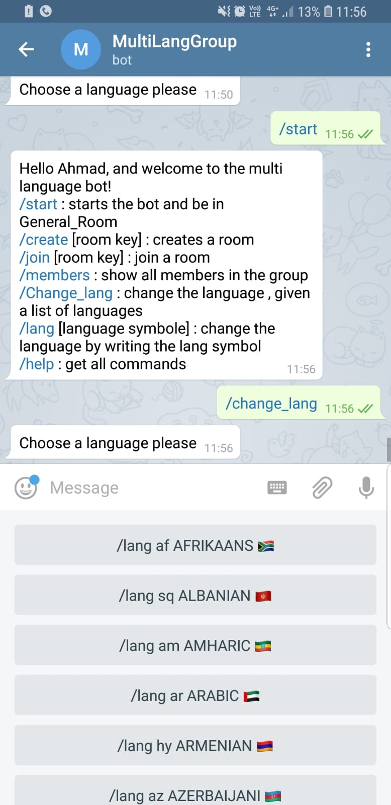
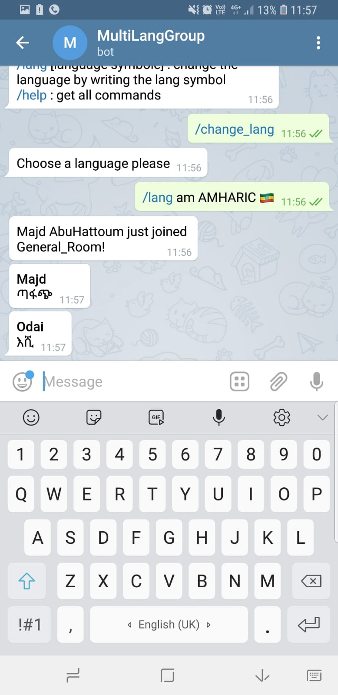
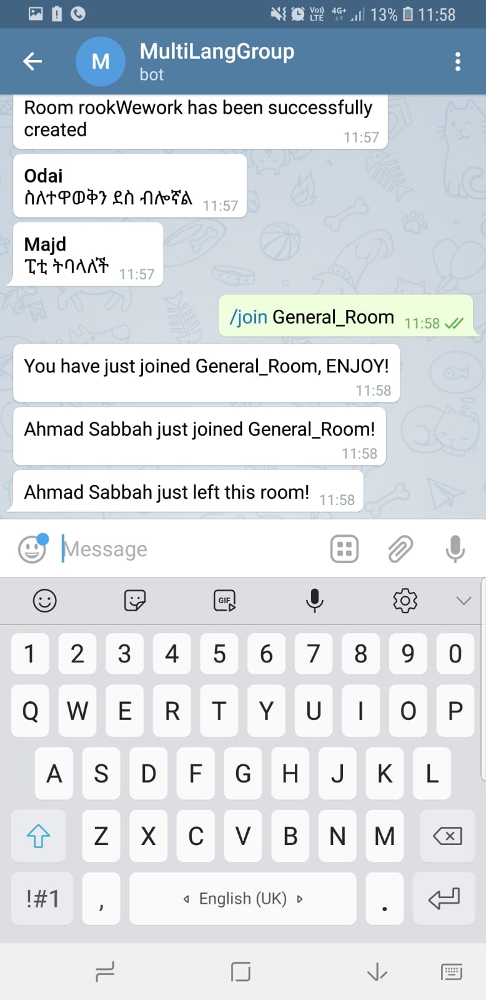

# AMORE Bot 🤖
Multilingual Translation Bot <https://t.me/MultiLangGroupBot>
* Ahmad Sabbah
* Rashid Khamis
* Odai Odeh
* Majd AbuHattoum
  

**AMORE Bot** is a friendly Telegram chatbot that enables users to have a multilingual translation of chats on the fly, connecting people from all over the world!
  

## Features
- Simultaneous translation of more than 100 languages
- Create and join chat rooms.
- Show other members in the room
- Adds a layer of anonymity
- Friendly interface 

## Screenshots
### Start command

### Change language command

### Join room command

## How to Run This Bot
### Prerequisites
* Python 3.7
* pipenv
* MongoDB

### Setup
* Clone this repo from github
* Install dependencies: `pipenv install`
* Get a BOT ID from the [botfather](https://telegram.me/BotFather).
* Create a `secret_settings.py` file:
        BOT_TOKEN = "your-bot-token-here"
### Run
To run the bot use:
    pipenv run python bot.py
(Or just `python bot.py` if running in a pipenv shell.)

## Credits and References
* [Telegram Docs](https://core.telegram.org/bots)
* [python-telegram-bot](https://github.com/python-telegram-bot/python-telegram-bot)
* [py-translator](https://pypi.org/project/py-translator)
